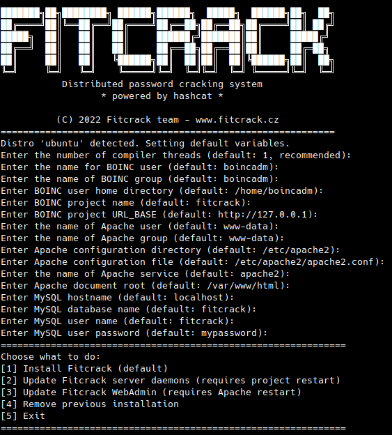

# Deploying Fitcrack server using installer

Note: Since Fitcrack 2.4.0, [Docker](INSTALL-Docker.md) is the recommended way
of deployment. Consider using Docker.

This document describes how to install Fitcrack server using installer.
It contains cookbooks for various popular Linux distros + general installation
instructions.

Table of Contents:
* [Step-by-step guide for Ubuntu 24.04 LTS](#instubu24)
* [Step-by-step guide for Debian 13](#instdeb13)
* [Step-by-step guide for CentOS Stream 9](#instcentos9)
* [General installation instructions (for Other Linux distros)](#instgen)
* [Debugging your Fitcrack server installation](#debugging)
* [Removing an existing installation](#removal)


<a name="instubu24"></a>
## Step-by-step: Install on Ubuntu 24.04 LTS

Open a **root** terminal, go to the directory with Fitcrack sources (with BOINC submodule) and proceed as follows.

### Install prerequisities
```
apt install -y m4 make dh-autoreconf pkg-config git vim apache2 libapache2-mod-php mysql-server mysql-common libmysqlclient-dev zlib1g zlib1g-dev php php-xml php-mysql php-cli php-gd python-is-python3 python3 python3-mysqldb python3-pymysql python3-pip libapache2-mod-wsgi-py3 libssl-dev libcurl4-openssl-dev apache2-utils pkg-config libnotify-dev curl perl libcompress-raw-lzma-perl nlohmann-json3-dev libzip-dev
```

### Setup the MySQL Database
Set-up the mySQL root user password and
create a database and user for Fitcrack. For example:
```
systemctl start mysql
mysql -e "ALTER USER 'root'@'localhost' IDENTIFIED WITH mysql_native_password by 'YOURROOTPASSWORD';"
mysql -u root -p
mysql> create database fitcrack;
mysql> CREATE USER 'fitcrack'@'localhost' IDENTIFIED BY 'mypassword';
mysql> GRANT ALL ON fitcrack.* TO 'fitcrack'@'localhost';
mysql> FLUSH PRIVILEGES;
mysql> SET PERSIST log_bin_trust_function_creators = 1;
mysql> SET PERSIST time_zone = '+00:00';
mysql> exit
```

### Setup the Apache web server
```
a2enmod cgi       # enable mod CGI
a2enmod rewrite   # enable mod rewrite
a2enmod wsgi      # enable mod wsgi
systemctl restart apache2
```

### Setup BOINC server user
```
useradd -m -c "BOINC Administrator" boincadm  -s /bin/bash
passwd boincadm   # choose some password to login later
```

### Add Apache user to the boincadm group
```
usermod -a -G boincadm www-data
reboot
```

### Install Fitcrack
```
./install_fitcrack.sh
```

And proceed according to your preferences...




<a name="instdeb13"></a>
## Step-by-step: Install on Debian 13

Open a **root** terminal, go to the directory with Fitcrack sources (with BOINC submodule) and proceed as follows.

### Install prerequisities
```bash
apt update
apt install -y \
  build-essential m4 make libtool autoconf automake dh-autoreconf pkg-config git vim \
  apache2 apache2-utils libapache2-mod-php libapache2-mod-wsgi-py3 \
  default-mysql-server default-mysql-client default-libmysqlclient-dev mysql-common \
  zlib1g zlib1g-dev php php-xml php-mysql php-cli php-gd \
  python-is-python3 python3 python3-pip python3-mysqldb python3-pymysql \
  libssl-dev libcurl4-openssl-dev libnotify-dev curl perl \
  libcompress-raw-lzma-perl g++-mingw-w64-x86-64 \
  wget xz-utils nlohmann-json3-dev libzip-dev python3-setuptools
```

### Install Node.js
```bash
mkdir -p /usr/local/lib/nodejs
cd /usr/local/lib/nodejs
wget -q https://nodejs.org/dist/v16.15.0/node-v16.15.0-linux-x64.tar.xz
tar -xJf node-v16.15.0-linux-x64.tar.xz
ln -sf /usr/local/lib/nodejs/node-v16.15.0-linux-x64/bin/node /usr/local/bin/node
ln -sf /usr/local/lib/nodejs/node-v16.15.0-linux-x64/bin/npm /usr/local/bin/npm
ln -sf /usr/local/lib/nodejs/node-v16.15.0-linux-x64/bin/npx /usr/local/bin/npx

node -v  # Should print v16.15.0
npm -v
```

### Install Python packages
```bash
python3 -m pip install --break-system-packages --ignore-installed urllib3==1.26.15 mysqlclient
```

### Setup the MariaDB server
```bash
systemctl enable --now mariadb || systemctl enable --now mysql

mysql -u root <<'EOF'
CREATE DATABASE fitcrack;
CREATE USER 'fitcrack'@'localhost' IDENTIFIED BY 'mypassword';
GRANT ALL PRIVILEGES ON fitcrack.* TO 'fitcrack'@'localhost';
SET GLOBAL log_bin_trust_function_creators = 1;
FLUSH PRIVILEGES;
EOF
```


### Setup the Apache web server
```bash
a2enmod cgi       # enable mod CGI
a2enmod rewrite   # enable mod rewrite
a2enmod wsgi      # enable mod wsgi
systemctl restart apache2
```

### Setup BOINC server user
```bash
useradd -m -c "BOINC Administrator" boincadm  -s /bin/bash
passwd boincadm   # choose some password to login later
```

### Add Apache user to the boincadm group
```bash
usermod -a -G boincadm www-data
reboot
```

### Install Fitcrack
```bash
./install_fitcrack.sh
```


<a name="instcentos9"></a>
## Step-by-step: Install on CentOS Stream 10

Open a **root** terminal, go to the directory with Fitcrack sources and proceed as follows.

### SELINUX
The following tutorial assumes **SELINUX** in permissive or disabled mode.
If you wish to use SELINUX enforcing mode on Fitcrack server machine, you have to configure policies to allow apache access to project directory and others.
```
sed -i s/^SELINUX=.*$/SELINUX=disabled/ /etc/selinux/config
reboot
```

### Enable required repositories
```bash
dnf install -y dnf-plugins-core
dnf config-manager --set-enabled crb
dnf install -y epel-release
dnf clean all
dnf makecache
```

### Install prerequisities
```bash
dnf install -y \
  m4 make libtool autoconf automake pkgconf-pkg-config \
  gcc gcc-c++ redhat-rpm-config \
  git vim wget xz curl perl perl-Compress-Raw-Lzma \
  httpd httpd-tools \
  php php-cli php-xml php-mysqlnd php-gd \
  python3 python3-devel python3-pip python3-setuptools python3-PyMySQL python3-mod_wsgi \
  mariadb-server mariadb mariadb-devel \
  zlib zlib-devel libcurl-devel openssl-devel libnotify-devel \
  libzip-devel json-devel initscripts patch
```

### Install Python packages for Fitcrack
```bash
python3 -m pip install mysqlclient urllib3==1.26.15
```

### Install Node 16.15

```bash
mkdir -p /usr/local/lib/nodejs
cd /usr/local/lib/nodejs
wget -q https://nodejs.org/dist/v16.15.0/node-v16.15.0-linux-x64.tar.xz
tar -xJf node-v16.15.0-linux-x64.tar.xz
ln -sf /usr/local/lib/nodejs/node-v16.15.0-linux-x64/bin/node /usr/local/bin/node
ln -sf /usr/local/lib/nodejs/node-v16.15.0-linux-x64/bin/npm /usr/local/bin/npm
ln -sf /usr/local/lib/nodejs/node-v16.15.0-linux-x64/bin/npx /usr/local/bin/npx
```

### Configure services
```bash
systemctl enable --now mariadb
systemctl enable --now httpd
```

### Create database and user
```bash
mysql -u root <<'EOF'
CREATE DATABASE fitcrack;
CREATE USER 'fitcrack'@'localhost' IDENTIFIED BY 'mypassword';
GRANT ALL PRIVILEGES ON fitcrack.* TO 'fitcrack'@'localhost';
SET GLOBAL log_bin_trust_function_creators = 1;
FLUSH PRIVILEGES;
EOF
```

### Create BOINC server user
```bash
useradd -m -c "BOINC Administrator" boincadm -s /bin/bash
passwd boincadm
```


### Add Apache user to the boincadm group
```bash
usermod -a -G boincadm apache
reboot
```

### Configure exceptions for firewalld:
```bash
firewall-cmd --zone=public --add-service=http --permanent
firewall-cmd --zone=public --add-service=https --permanent
firewall-cmd --zone=public --add-port=5000/tcp --permanent
firewall-cmd --reload
```

### Install Fitcrack
```bash
./install_fitcrack.sh
```

### Enable Fitcrack service
If you installed Fitcrack as a system service you may enable it:
```bash
/usr/lib/systemd/systemd-sysv-install enable fitcrack
```
This will make Fitcrack start automatically on future boots.


<a name="instgen"></a>
## General installation instructions (Linux-wide)

### Software prerequisites
* make (3.79+)
* m4 (1.4+)
* libtool (1.5+)
* autoconf (2.58+)
* automake (1.8+)
* GCC / G++ (6.3.0+)
* pkg-config (0.15+)
* Perl with LZMA support (`libcompress-raw-lzma-perl` or equivalent)
* Python 3
* pip for Python 3
* setuptools for Python 3
  * needed especially on Python 3.12+, where `distutils` was removed
* MySQL (4.0.9+) or MariaDB (10.0+)
* MySQL/MariaDB client development libraries and headers
* Python MySQL bindings (`mysqlclient` / MySQLdb, or distro equivalent)
* libnotify development files
* libzip development files (`zip.h`)
* nlohmann::json headers (`nlohmann/json.hpp`)
* Apache with the following modules:
  * PHP with CLI support
  * PHP XML module
  * PHP MySQL module
  * PHP GD module
  * CGI
  * WSGI
  * rewrite
* OpenSSL (0.98+)
* Curl / libcurl development files
* GTest (only if you intend to build the tests in `server/src/tests`)


### Installation
Create a user for running BOINC server
```
useradd -m -c "BOINC Administrator" boincadm  -s /bin/bash
```
Create a MySQL database and user account for Fitcrack
```
mysql -u root -p
mysql> create database fitcrack;
mysql> GRANT ALL PRIVILEGES ON fitcrack.* TO 'fitcrack'@'localhost' IDENTIFIED BY 'mypassword';
```
As root, run the Fitcrack installer:
```
./install_fitcrack.sh
```


<a name="removal"></a>
## Removing an existing installation

As root, use the Fitcrack installer:
```
./install_fitcrack.sh
```
In the main installer menu, select **Remove existing installation**,
after that, select `y` for the parts of the Fitcrack server
that you want to remove.


<a name="debugging"></a>
## Debugging
Many of reported issues were caused by improper network configuration.
To debug connectivity issues, check the configuration of your Apache
web server. Look if the server is listening on the correct ports:
5000 for WebAdmin backend, and 80 for WebAdmin frontend and BOINC scheduler
(for non-HTTPS deployments). You can also use tools like
`netstat` to check which services are listening on what ports.

For debugging WebAdmin, you should
first check if the backend is running, e.g.: `http://localhost:5000`.
You can also check the frontend configuration file `http://localhost/static/configuration.js`
if it is connecting to the proper address. By default, backend's hostname is taken
from you browser URL hostname. If the backend is malfunctioning, you can
check your Apache error log, e.g. `/var/log/apache2/error.log` to see
what's wrong.

For debugging BOINC server, check if the hostname, protocol and ports are set properly
on both server and client machines. With default settings, BOINC clients should
connect to the project server at `http://127.0.0.1/fitcrack`. In case of connectivity issues,
check that the hostname/IP are correct. Also, see if all daemons are running
on the WebAdmin: System - **Server monitor** page.
For debugging your daemons (Generator, Assimilator, etc.), you can check
logs in your BOINC project directory, e.g. `/home/boincadm/projects/fitcrack/logs`
to see what's wrong.
Configuration of the BOINC server is located in the `config.xml` file in your
BOINC project directory, e.g. `/home/boincadm/projects/fitcrack/config.xml`.
Here, you can configure many parameters like the DB username and password, or what
daemons and tasks should run when Fitcrack is started.
Nevertheless, changing URL base in parameters like `master_url` is not enough to convince
your hosts to use a different link. Changing the hostname/IP URL on-the-fly is not
a simple task, as the URLs are hardcoded inside the BOINC database
tables (e.g. app, versions).
