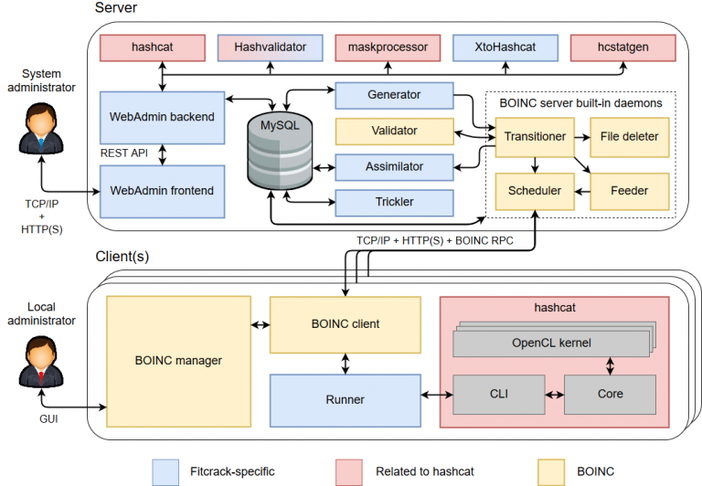

# Manual installation of Fitcrack server

## Disclaimer
A purely manual installation of Fitcrack is an **uneasy**
and **painful** process that is only recommended to
highly experienced users or modders/developers.
In all other cases, we recommend deployment with [Docker](INSTALL-Docker.md)
or using the [Installer](INSTALL-Installer.md).

Pleas note that we provide **NO SUPPORT OR ASSISTANCE** if something goes wrong!

## Steps to follow

A Fitcrack server installation consists of:
* **Runner** - This is an app that controls hashcat on the host machines.
  * Runner can be compiled for 64/32-bit versions of Linux/Windows.
  * If you don't have a pre-compiled version, you need to compile it before installing the BOINC server.
  * You should to compile it for all host platforms you want your Fitcrack system to support.
  * See [runner/README.md](runner/README.md) to learn how to compile the Fitcrack Runner.
* **BOINC server** - This is the core of Fitcrack that does all the magic.
  * It consists of both native BOINC applications (e.g., Scheduler, feeder, transitioner) and Fitcrack-specific daemons (e.g., work_generator, assimilator, trickler).
  * It interacts with the database and files in the deployed project.
  * The Scheduler subsystem runs as a FastCGI application over Apache to communicate with the cracking hosts using the BOINC Scheduling server protocol.
  * You first need to build it from sources.
  * Once the server is built, you create a `project` - an actual Fitcrack server deployment.
  * See [server/README.md](server/README.md) to learn how to build the BOINC server and create a new project.
* **WebAdmin** - Our cool app for interacting with the Fitcrack system, managing jobs, and controlling your cracking network.
  * This app consist of two parts: The `backend` in Python3, Flask and SQLAlchemy, and a `frontend` in Vue JS.
  * The `backend` controls the server, communicates directly with the database and provides the `FitcrackAPI`.
  * The `frontend` is essentially what users see. It runs in the browser and communicates with the `FitcrackAPI`.
  * The `FitcrackAPI` can also be used by external apps. For this purpose, we provide a neat documentation in Swagger, which you can find directly at: `http://<YOUR.SERVER.HOSTNAME>:5000`
  * See [webadmin/README.md](webadmin/README.md) to learn how to build and install the Fitcrack WebAdmin.

## Modding / tinkering

Fitcrack was created as an open-source research project and is distributed as free software.
This means, you can do your custom modifications, forks, and extensions - See [LICENSE](LICENSE).

A detailed specification of the architecture is also available in the following **technical report**: [The Architecture of Fitcrack Distributed Password Cracking System, version 2](https://fitcrack.fit.vutbr.cz/files/doc/TR_Fitcrack_architecture.pdf).
Yet, for modding of the sources, also read the comments as the Techreport is not updated so frequently.

If you have a nice improvement for Fitcrack, we will be happy if you share it with us, e.g. by creating a **Pull Request** on Github.
