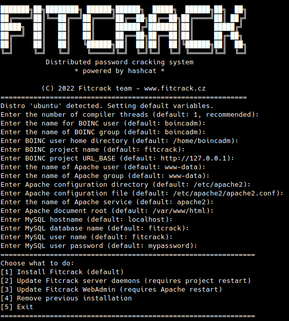

# Fitcrack (Distributed password cracking system)

This README describes how to install and run Fitcrack distributed password cracking system.
There are four ways of deployment:

* Using installer + [Step-by-step guide for Debian 9 / Ubuntu 18.04 LTS](#instdeb) (recommended way)
* Using installer + [Step-by-step guide for CentOS/RHEL 7](#instcentos) (recommended way)
* Using installer + [General installation instructions](#instgen)
* Manual install:
  * For **BOINC and Fitcrack server**, see [server README](server/README.md)
  * For **Fitcrack WebAdmin**, see [WebAdmin README](webadmin/README.md)
  * For **Custom build of Runner**, see [Runner README](runner/README.md)

Once installed, see how to [Operate the server](#oper)

<a name="instgen"></a>
## General installation instructions

### Software prerequisities
* make (3.79+)
* m4 (1.4+)
* libtool (1.5+)
* autoconf (2.58+)
* automake (1.8+)
* GCC (6.3.0+)
* pkg-config (0.15+)
* Python 2 (2.2+)
* Python 3
* pip for Python 3
* MySQL (4.0.9+) or MariaDB (10.0+)
* libnotify-dev
* Apache with the following modules:
  * PHP (5+) with XML and MySQL modules
  * CGI
  * WSGI
  * rewrite
* PHP5 with cli support and the GD and MySQL modules
* OpenSSL (0.98+)

### Installation
Create a user for running BOINC server
```
useradd -m -c "BOINC Administrator" boincadm  -s /bin/bash
```
Create a MySQL database and user account for Fitcrack
```
mysql -u root -p
mysql> create database fitcrack;
mysql> GRANT ALL PRIVILEGES ON fitcrack.* TO 'fitcrack'@'localhost' IDENTIFIED BY 'mypassword';
```
As root, use Fitcrack installer:
```
./install_fitcrack.sh
```
And proceed according to your preferences...



<a name="instdeb"></a>
## Step-by-step: Install on Debian 9 / Ubuntu 18.04 LTS

Open a **root** terminal, go to the directory with Fitcrack sources and proceed as follows.

### Debian 9: (Optional) Switch to MySQL
In Debian 9, MariaDB is used by default instead of MySQL community server.
If you wish to switch to MySQL, type:
```
wget https://dev.mysql.com/get/mysql-apt-config_0.8.10-1_all.deb
dpkg -i mysql-apt-config_0.8.10-1_all.deb
apt-get update
```
Otherwise, in the prerequisities below, you have to choose **libmariadb-dev**, instead of **libmysql-dev**, etc.

### Install prerequisities
```
apt-get install m4 make dh-autoreconf pkg-config git vim apache2 libapache2-mod-php mysql-server mysql-common libmysqlclient-dev zlibc zlib1g zlib1g-dev php php-xml php-mysql php-cli php-gd python python python3 python-mysqldb python3-pymysql python3-pip libapache2-mod-wsgi-py3 libssl-dev libcurl4-openssl-dev apache2-utils libboost1.62-all-dev pkg-config libnotify-dev

mysql_secure_installation # Set MySQL root password

a2enmod cgi       # enable mod CGI
a2enmod rewrite   # enable mod rewrite
a2enmod wsgi      # enable mod wsgi
systemctl restart apache2
```
### Setup user and Database
```
useradd -m -c "BOINC Administrator" boincadm  -s /bin/bash
mysql -u root -p
mysql> create database fitcrack;
mysql> GRANT ALL PRIVILEGES ON fitcrack.* TO 'fitcrack'@'localhost' IDENTIFIED BY 'mypassword';
```

### Install Fitcrack
```
./install_fitcrack.sh
```

<a name="instcentos"></a>
## Step-by-step: Install on CentOS/RHEL 7

Open a **root** terminal, go to the directory with Fitcrack sources and proceed as follows.

### SELINUX
The following tutorial assumes **SELINUX** is disabled.
If you wish to use SELINUX on Fitcrack server machine, you have to configure policies manually, or wait for an udpate of the tutorial.

### Add MariaDB 10 repository
Create file `/etc/yum.repos.d/MariaDB.repo` with the following contents:
```
[mariadb]
name = MariaDB
baseurl = http://yum.mariadb.org/10.1/centos7-amd64
gpgkey = https://yum.mariadb.org/RPM-GPG-KEY-MariaDB
gpgcheck = 1
```

### Install prerequisities
Enable IUS, EPEL, and IUS repositories
```
yum install -y https://$(rpm -E '%{?centos:centos}%{!?centos:rhel}%{rhel}').iuscommunity.org/ius-release.rpm
yum install -y epel-release centos-release-scl
```

Install necessary packages:
```
yum install -y devtoolset-7 m4 libtool autoconf automake  git vim httpd php php-mysql mod_wsgi mariadb-server mariadb-devel zlib libcurl-devel openssl-libs python python36 python36u-mod_wsgi python36u-setuptools  MySQL-python python2-PyMySQL  boost* pkgconfig libnotify
```
Set Python 3.6 as default Python3 version:
```
alternatives --install /usr/bin/python3 python3 /usr/bin/python3.6 60
```

```
easy_install-3.6 pip
systemctl start httpd.service
systemctl enable httpd.service
systemctl start mariadb
mysql_secure_installation # Set MariaDB root password
systemctl enable mariadb.service
```

### Setup user and Database
```
useradd -m -c "BOINC Administrator" boincadm  -s /bin/bash
mysql -u root -p
mysql> create database fitcrack;
mysql> GRANT ALL PRIVILES ON fitcrack.* TO 'fitcrack'@'localhost' IDENTIFIED BY 'mypassword';
```

### Switch to GCC6 and Install Fitcrack
```
scl enable devtoolset-7 bash
./install_fitcrack.sh
```

<a name="oper"></a>
## Operating the server

The **default** login credentials to the WebAdmin are:
* login: ``fitcrack``
* password: ``FITCRACK``

At the end of the installation, the installer asks you if you wish to start
the server daemons. If you decide not to, you can do that manually as described below:

## Running the server

Login to the server as BOINC user (e.g. `boincadm`) and enter the project directory:
```
boincadm@myserver:~$ cd projects/fitcrack
```

### Get server status
```
boincadm@myserver:~/projects/fitcrack$ ./bin/status
```

### Start Fitcrack server
```
boincadm@myserver:~/projects/fitcrack$ ./bin/start
```

### Stop Fitcrack server
```
boincadm@myserver:~/projects/fitcrack$ ./bin/stop
```

## Optional: multiple workunits per hosts

In Fitcrack, it is possible to assign 2 (or more) workunits per node, and make a node compute a single one, while the others are downloading in backgroud. This reduces the overhead for traffic-extensive attacks - e.g. dictionary ttack with big dictionaries.

To achieve this behavior, in your project config, e.g. `/home/boincadm/fitcrack/config.xml` add in `<boinc><config>` section find the following line:
```
<max_wus_in_progress>1</max_wus_in_progress>
```
and replace it to:
```
<max_wus_in_progress>2</max_wus_in_progress>
```

and restart the server (as BOINC user):
```
boincadm@myserver:~$ cd projects/fitcrack
boincadm@myserver:~/projects/fitcrack$ ./bin/stop
boincadm@myserver:~/projects/fitcrack$ ./bin/start
```

Then on each node, you limit maximum concurrent workunits to 1 by creating `app_config.xml` file in your BOINC client project directory, e.g.:
* `C:\ProgramData\BOINC\projects\myserver_fitcrack` (Windows)
* `/var/lib/boinc-client/projects/myserver_fitcrack/app_config.xml` (Linux)
Please note, that the project directory is created automatically once you add the project to you BOINC client (e.g. via BOINC Manager).

To `app_config.xml` place the following contents:
```
<app_config>
   <app>
      <name>fitcrack</name>
      <max_concurrent>1</max_concurrent>
      <report_results_immediately/>
    </app>
</app_config>
```
