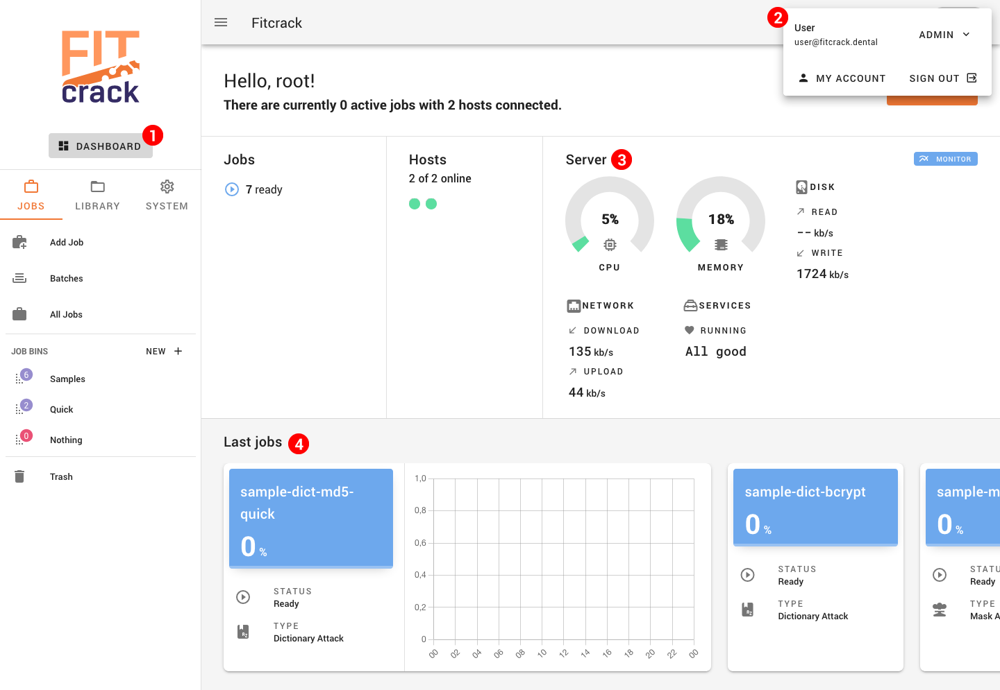

# Fitcrack Webadmin User's Guide

Welcome to the Fitcrack User's Guide. A comprehensive documentation of the Webadmin app used to control the password cracking system developed at BUT FIT. To get started, select a topic in the sidebar or [continue with Quick Start](guide/start.md).

<!--  -->

## What is Fitcrack?

**Fitcrack** is a distributed password cracking system. It can be used for recovering passwords securing various types of encrypted media like documents, archives, or disk volumes, as well as for breaking raw cryptographic hashes.

Thanks to the integration with [Hashcat](https://hashcat.net/) tool, Fitcrack provides a wide range of supported formats and great speed with the use of proper hardware. The computation is hardware-accelerated by using OpenCL technology and thus, the cracking can be performed on all OpenCL-compatible CPUs, GPUs, FPGAs, DSPs, or coprocessors.

Our system is based on [BOINC](http://boinc.berkeley.edu/) framework for distributed computing which allows Fitcrack to provide a relatively high level of automatization whithout limiting the flexibility of the system, or administrator’s freedom of creating a custom design and configuration of a distributed network.

Fitcrack was created within the [NES@FIT](http://www.fit.vutbr.cz/research/groups/nes@fit/index.php.en) reasearch group on [Faculty of Information Technology, Brno University of Technology](http://www.fit.vutbr.cz/.en). Rather than a ready-made product, it represents an experimental prototype primarily used for research and testing of new password recovery techniques. It is freely available under [MIT license](https://opensource.org/licenses/MIT) Since Fitcrack is an experimental prototype, you can only use it at your own risk. We will not be held in any way responsible for your decision.
