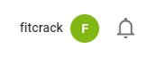
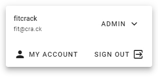
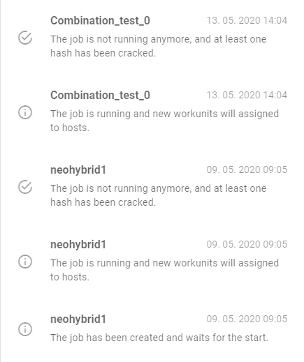
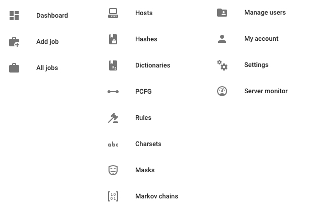

Navigating the App
==================

Webadmin is a web application and you can use it on any device with a web browser that has access to your server. This means that the app will look different on various form factors, for example a phone.

After logging in, you will see a permanent app bar up at the top and a navigation menu on the left. These are always available regardless of current context.

> Note that the navigation may be hidden on narrower screens. To toggle it, use the hamburger menu icon on the far left of the app bar or swipe from the left edge on a touch screen.

App Bar and Notifications
-------------------------

The app bar is always at the top and gives you access to the navigation, if it is hidden. On the right side, there is your profile name and a button to open the notification drawer.

Clicking the profile name will bring up the account flyout, where you can see your role and permissions, go to the Account page or sign out.

The notification drawer shows all of the notifications you received about job statuses and more. They are shown from newest to oldest.

Main Navigation
---------------

The main navigation links to every part of the system. You can find a very brief overview of each of them below.

- _Jobs tab_
  - __Dashboard__ – The default view with an excerpt from critical parts of the system
  - __Add Job__ – The job creation form, see [Creating Jobs](/jobs/creating/overview.md)
  - __Batches__ – Lists created job queues (batches), see [Batch Cracking](/jobs/managing/batches.md)
  - __All Jobs__ – Lists all created jobs, see [Jobs List](/jobs/managing/list.md)
  - Bins are job collections, see [Job Bins](/jobs/managing/bins.md)
- _Library tab_
  - __Hashes__ – Shows hashes known and stored by the system
  - __Dictionaries, PCFG, Rules, Charsets, Masks and Markov Chains__ – Shows the respective assets used in cracking and allows creating or uploading them
- _System tab_
  - __Hosts__ – Lists all host nodes connected to the system
  - __Job Templates__ – Lists saved job templates for management
  - __Manage Users__ – Allows administrators to create and change user accounts, and to create or assign roles
  - __Server Monitor__ – Shows server resource usage and service status
  - __Settings__ – Shows various settings for Webadmin and also for the Fitcrack configuration
  - __Data Transfer__ – Allows you to export and import jobs
