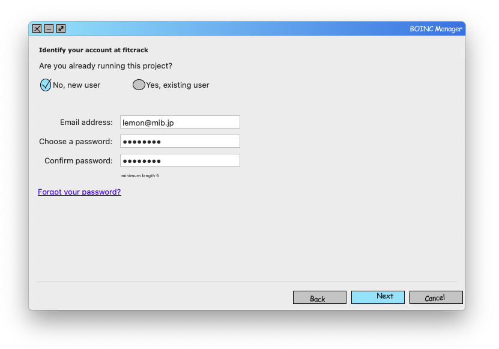

Host Nodes
==========

Since Fitcrack is a distributed system, the server running Webadmin and the database is not itself doing the cracking (unless you want it to). The jobs are distributed between compute nodes (hosts) that you connect to the system using [BOINC](//boinc.berkeley.edu).

Hosts can only be added by attaching their BOINC client to the Fitcrack project on your server. They can also only be removed by detaching the project. In other words, you have no control over them in Webadmin.

When Fitcrack distributes workunits (parts of jobs), it takes into account the capabilities of each host. The workunits are tailor-made for that hardware's power.

Connecting Hosts
----------------

To connect a machine to the system, it needs to run Windows or Linux. The BOINC client software is also required, as that is what Fitcrack uses to communicate with hosts. Install it from the official website or using a package manager on your system.

### Using BOINC Manager

In a desktop environment, you can use the BOINC GUI. The screenshots below are actually platform-agnostic.

1. Click _Add Project_ in BOINC (or, if in the advanced view, select _Tools > Add Project_ from the menu bar)

2. Enter the URL of the server where your Fitcrack installation is running, with `/fitcrack` at the end 

3. Create a new user (or use existing project credentials in later connections)

4. Finish adding the project, your host will soon appear in Webadmin

> Note that BOINC Manager will open a webpage of the project to finish your registration. You should fill out your name and confirm, but you __do not have to search for or join a team!__

### Using the command line

If you want to connect a host without a graphical display, for example a server you tunnel into via ssh, you can use the `boinccmd` utility.

1. __Get a key__ by creating or looking up an account
    - To create an account, run `boinccmd --create_account <URL> <email> <password> <name>`
      (Mirroring the Manager example: `boinccmd --create_account http://mycracker.example.org/fitcrack lemon@mib.jp fufufufu Lemon`)
    - If you have an existing account, run `boinccmd --lookup_account <URL> <email> <password>` 
      (With example credentials, this becomes `boinccmd --lookup_account http://mycracker.example.org/fitcrack lemon@mib.jp fufufufu`)
2. Copy the account key returned by the `create_account` or `lookup_account` command
3. Run `boinccmd --project_attach <URL> <account_key>` __with the key you copied__
   (Again, for the Manager example: `boinccmd --project_attach http://mycracker.example.org/fitcrack 3bc280b...`)
4. That's all, your host will soon appear in Webadmin
