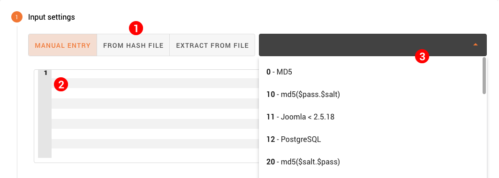

Hash Input
==========

When creating a job, you will have to provide the hash or hashes to crack. Fitcrack Webadmin offers three ways to do this.

Select a method using the toggle button __(1)__. Depending on the input method you choose, Fitcrack may be able to automatically detect the type of hash after you enter it. If not, you have to select the type manually from the dropdown __(3)__.

Let's take a look at the available input methods:

Manual Entry
------------

This method is selected by default. As the name suggests, you enter the hashes in text form in the input field __(2)__ manually. Enter each hash on its own line.

This method cannot detect the hash type just from the text you enter, so you'll have to select the type from the hash type list __(3)__. After you do this, the hashes will be validated and valid lines will have a checkmark icon at the end.

> For more on hash validation, see the [Overview](/jobs/creating/overview.md) section in this chapter.

From Hash File
--------------

This method is simmilar to manual entry. Instead of inputting the hashes manually in a text field, however, you select a file to read. The file you select will not be uploaded to the server. Your browser will read the file contents and add the hashes to the input. From there, the proccess is identical as before, the hashes get validated after you select the hash type in the dropdown __(3)__.

The files you select should contain hashes on separate lines, just like when entering manually. One difference to the manual entry method is that you can select not only a text file, but a binary hash file too.

Extract from File
-----------------

Using this method, you can extract hashes from encrypted files. An example of this might be a password protected PDF document or an archive, like zip or 7z. To do this, Webadmin uses a tool called XtoHashcat, that runs on the server; hence, the selected file will have to be uploaded to the server and processed there.

If the tool succeeds in extracting the hash, it will be added to the input. The hash type will also be selected automatically in most cases, and the hash will be validated immediately.
