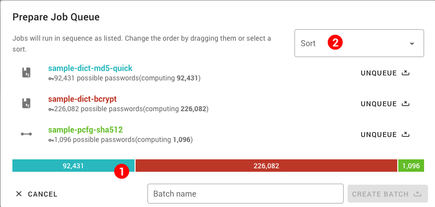

Batch Cracking
==============

To run multiple jobs in a sequence, you can create a batch queue. This is preferred to starting all the jobs at once, as it helps to distribute the jobs to all hosts in order, instead of trying to distribute parts of all of the jobs simultaneously.

Creating a Batch
----------------

Make a selection while listing jobs from any view and select _Batch Run_ from the selection toolbar. The batch preparation dialog will appear. ´

> Note that only jobs that are ready (not have been run yet) will be added to the queue

The selected ready jobs will be shown color coded with a preview of their password amount (and thus probable cracking times distribution) as a graph at the bottom __(1)__. You can reorder them by dragging or use a predefined sorting from the dropdown __(2)__. When ready, provide a name and select _Create Batch_ at the bottom. You will be taken to the bacth detail view.

Batch List and Detail
---------------------

You can see all your batches in the list accessed via the _Batches_ link in the Jobs tab of the navigation. Detailed view is available, showing the overall progress and the list of jobs.

To control the batches, use the shortcut in the list or open the detail view. Batches can be started and interrupted or resumed. A failed job may interrupt the batch. From the detail view, you can also rename or delete the batch. While editing, you can reorder the job list again.
