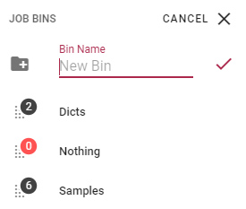
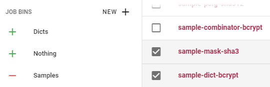

Job Bins
========

Bins allow you to create your own job lists and add or remove jobs from them at will. This functionality is baked into the navigation bar's Jobs tab.

Bin management
--------------

To create, move, edit and delete bins, you need to have the global editing permission. Create a bin using the 'New' button in the Job Bins header. Provide a name and confirm with the tick button or press enter.

Created bins are listed below and can be arranged by dragging the dots icon with the number. This shows how many jobs are contained within the bin. 

Adding jobs
-----------

To add jobs to a bin, make a selection in any job listing, such as _All Jobs_ or a bin that already has jobs in it. When you select jobs in the table using the checkboxes, The bin icons will change to a plus (or minus for the bin you are in for removing the selected jobs) and allow you to add the selected jobs to any of the bins by clicking on it.

When listing a bin, you can rename or delete it from the top bar. You can also delete bins by pressing the delete key while viewing them.
