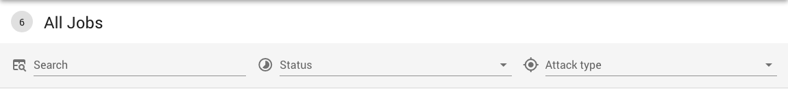
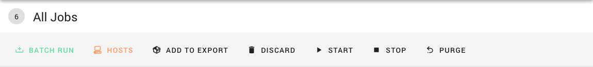
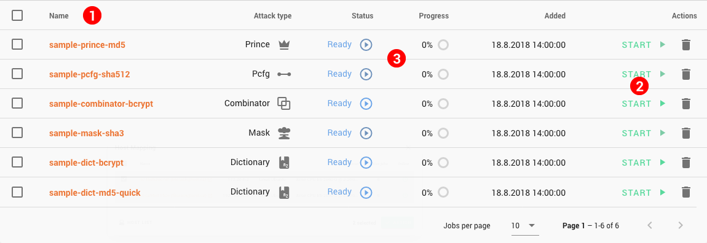

Jobs List
=========

To see the jobs list, navigate to the _All Jobs_ page via the main navigation bar. From here, you can also get to the individual jobs' [detail views](/jobs/managing/detail.md).

The jobs list shows all the jobs currently in the system in a paginated table, and allows you to search and filter them. Jobs can also be hidden from the main listing and are then shown separately.

Search and Filter
-----------------

At the top of the list page is a search and filter bar. You can search for a job by its name. To filter the list, you can choose a job status and/or an attack mode as a constraint.

While there are jobs selected in the table, the panel changes to the selection toolbar to show several actions available for working with multiple jobs at a time.

Listed Jobs
-----------

Jobs satisfying the selected criteria are shown in a table view below the controls. The table is paginated and only shows a selected number of rows at a time. Using some of the shown table headers __(1)__, you can also sort the table by their respective columns.

The table shows the job name, which is also a link to its detailed view, along some of the most useful stats to know at a glance, such as current state and progress.

> Move your cursor over the status text to see a brief description.

You can select multiple jobs to make actions using the checkboxes at the start of the rows. At the end of each row, there are quick actions __(2)__ you can use to control the job right from the listing.

From the list, you can also quickly see which jobs are missing required options, such as assigned hosts. This is represented by a warning icon __(3)__ in the status column.
