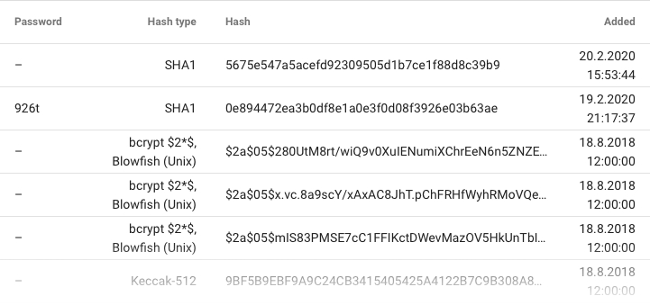
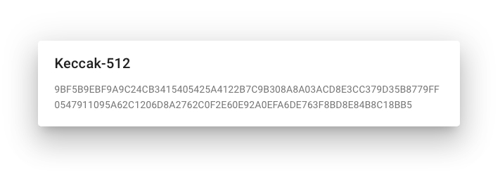

Hash Cache
==========

The _Hashes_ page lists all hashes currently stored in the hash cache. The system stores every hash that was entered, along with their passwords, if they were found.

This is why you can sometimes see the message _Hash already in hash cache_ when entering hashes into a cracking job input. You can still create a job with such hashes, but you may also find them in the cache and skip the cracking altogether.

If a hash doesn't fit the table, it will be truncated with ellipsis. You can see all of it by clicking on it, which will pop up a box with the full hash.

The Fitcrack installation also comes with a set of preloaded hashes. These function as a default rainbow table.
