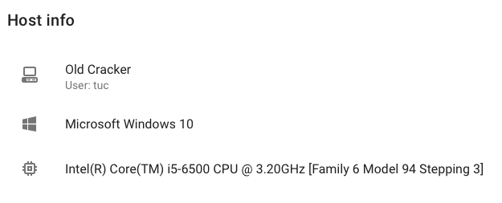

Host Management
===============

The hosts page lists all hosts currently attached to the system's BOINC server. You can see their name, basic specs and whether they are online or, if not, when they were last seen.

Clicking on a host will show you more information about them, with a breakdown of what jobs they were taking part in below. The bottom table then shows workunits that were given to this host to work on.

> If you are looking for guidance on attaching or detaching hosts to/from the system, see the [introduction to hosts](/guide/hosts.md).
