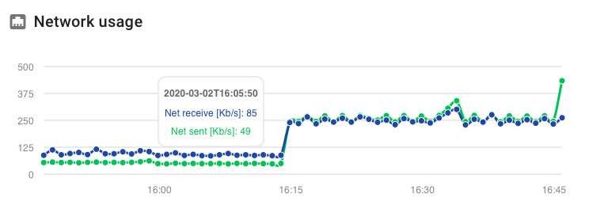

Server Monitor
==============

The server monitor page shows which Fitcrack and BOINC services are running on the server (the one running Webadmin as well) and displays resource usage as graphs.

You can view concrete values by hovering over any point on the sparkline. To change the time interval for which data is shown, use the radio buttons at the bottom of the page.
