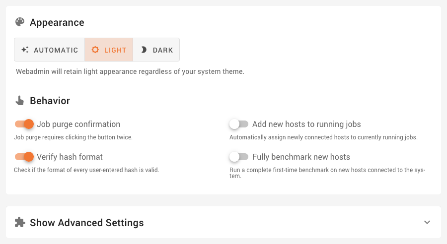

System Settings
===============

You can set up Webadmin appearance and system behavior on this page.

Use appearance to set your preferred theme. This setting only affects your client web browser.

- __Automatic__ – This uses your system preference if available. macOS, Windows, modern versions of GNOME, and other environments allow you to choose a light or dark theme. Webadmin will react to any changes to this system value.
- __Light and Dark__ – Always uses the selected theme.

Various aspects of Webadmin as well as the system can be tuned in the behavior section.

- __Job purge confirmation__ – Purging a job deletes all progress. To avoid accidental loss of data, turn this on. The purge button now effectively requires you to double-click.
- __Verify hash format__ – When creating a job, your hashes will be verified by the Fitcrack server.
- __Add new hosts to running jobs__ – When you connect a new host to the system, it can be assigned to any running job right away. Codename 'Automatically job'.
- __Fully benchmark new hosts__ – Newly connected hosts will go through a full benchmark suite. This takes a while, so the default is to do benchmarks on demand later.

Advanced settings
-----------------

You can fine-tune your installation using these advanced settings. Be careful, these are hidden for a reason.
