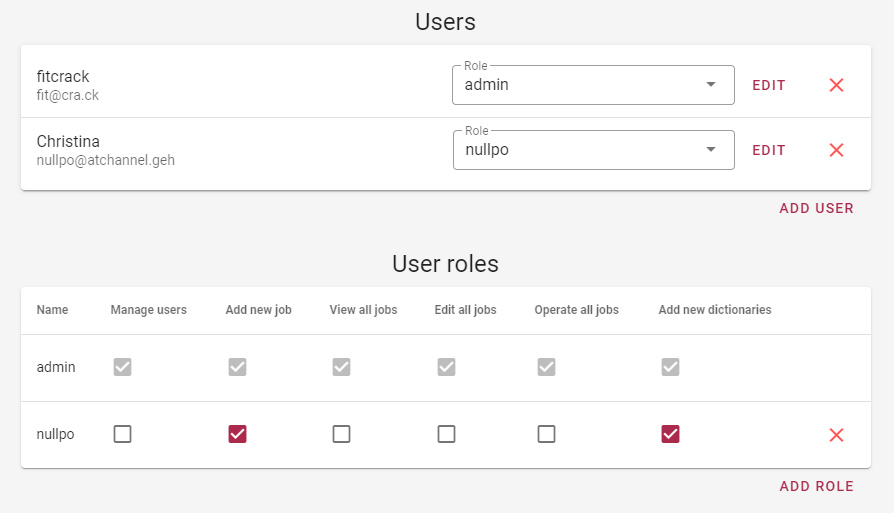
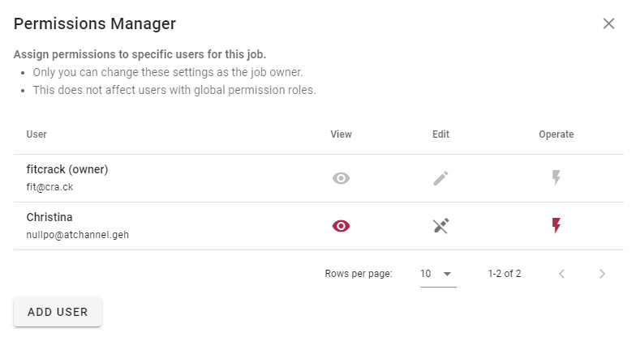

Users and Permissions
=====================

There are several permissions your users can be granted via roles. You can add users and roles via the _Manage users_ page.

The permissions are briefly described below.

- __Manage users__ – Allows access to the management page
- __Add new job__ – Allows access to the job creation form
- __View all jobs__ – Allows to view all jobs and batches regardless of individual permissions
- __Edit all jobs__ – Allows to edit all jobs and batches regardless of individual permissions, along with creating and managing job bins
- __Operate all jobs__ – Allows to operate (start, stop, etc.) all jobs and batches regardless of individual permissions
- __Add new dictionaries__ – Allows to upload dictionary files to the server

Individual Job Permissions
--------------------------

Each job (and batch, as well) has its owner. This is the user that created the job. The owner always has all permissions on their job, but they can also grant any of the the permissions (view, edit and operate) to individual users in the system.

To do this, open the job's detail view, enter edit mode and select _Permissions_ in the action bar. The Permissions Manager dialog will appear. Here, use the _Add User_ button to pick a user to grant permissions to, and then enable or disable the permissions as you wish. Your changes are saved automatically.

